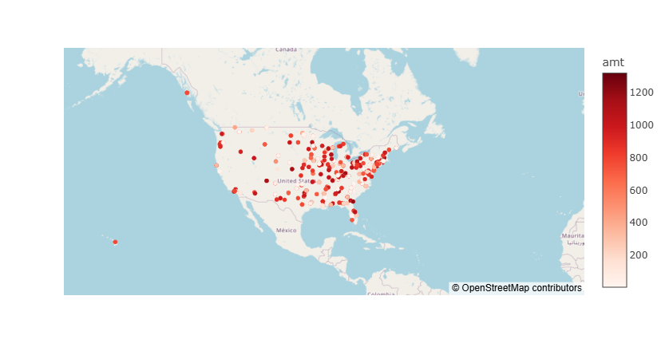
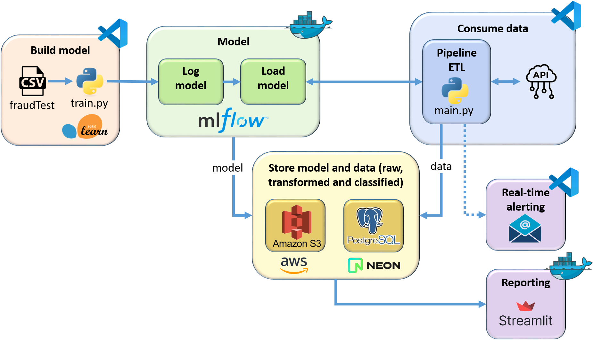

# 🧪 Projet BLOC_4_FRAUD_DETECTION

## 🎯 **Objectifs du projet**
- Mise en place d'un système de détection automatique des transactions frauduleuses par carte bancaire
- Alerte en temps réel dès qu'une fraude est détectée
- Reporting quotidien de toutes les transactions et fraudes de la veille

## 📊 **Montant des fraudes constatées en 2020**


- Analyse du dataset des données historiques 
- Visualisation des différentes features disponibles

## 🚀 **Entraînement du modèle**
- Preprocessing des données
- Choix du Random Forest Classifier comme baseline de Train
- Stockage du modèle dans MLFlow (via Docker)

## 🛠️ **Pipeline**

- **EXTRACT** :
- Appel à une API pour simuler des transactions en temps réel
- Stockage des fichiers .json bruts dans un bucket S3

- **TRANSFORM** :
- Chargement du modèle depuis MLFlow (via Docker)
- Preprocessing sur les fichiers .json bruts (convertis en Dataframe)
- Application du modèle de classification : classification=0 > pas de fraude ; classsification=1 > FRAUDE détectée
- Prévu mais non développé : envoi d'un mail automatique en temps réel dès qu'une fraude est détectée !
- Enregistrement des transactions + classifications (au format .csv) dans le bucket S3

- **LOAD** :
- Stockage des données transformées et claissifiées dans un base de données (Neon DB)

## 💻 **Rapport des transactions de la veille**
- Données exposées dans Streamlit (via Docker)

## Architecture du projet




## 📁 Arborescence du projet

```bash
BLOC_3_FRAUD_DETECTION/
│
│── .venv/                       # Environnement virtuel Python
│
├── app/
│   ├── __init__.py
│   ├── extract.py
│   ├── load.py
│   ├── main.py
│   ├── train.py
│   └── transform.py
│
├── data/                         # Données utilisées dans l'app
│   └── fraudTest.csv             # Dataset source
│
├── docker/                       
│   ├── Dockerfile                # Conteneur d'exécution du projet          
│   └── requirements.txt          # Dépendances Python
│
│── EDA/
│   └── EDA.ipynb                 # Data analyse et visualisation
│
│── streamlit/                       
│   ├── Dockerfile                # Conteneur d'exécution de Streamlit          
│   ├── requirements.txt          # Dépendances Python pour Streamlit
│   └── streamlit.py
```


